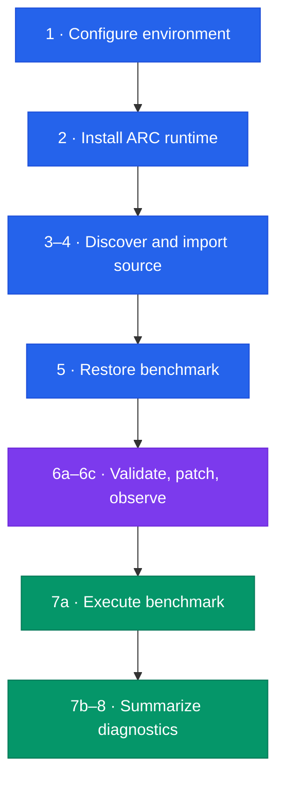
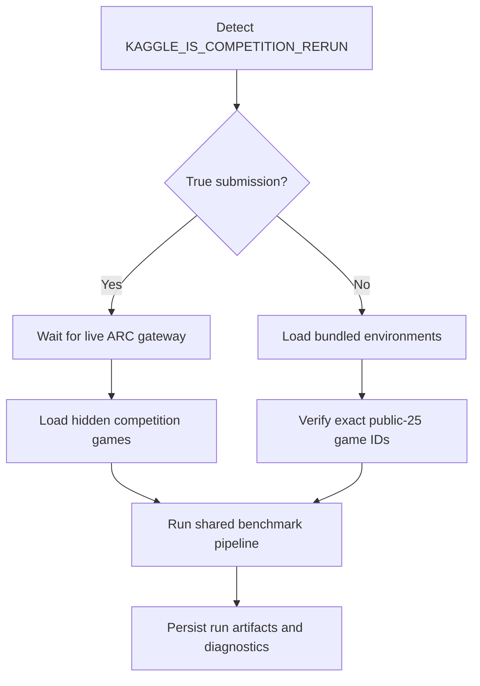
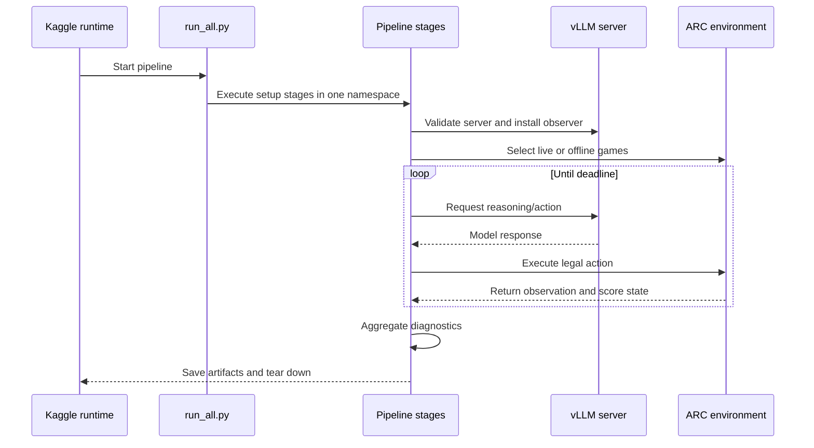
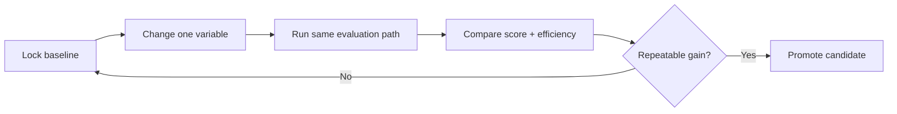

<div align="center">

# 🧩 ARC APEX

### Adaptive Reasoning & Problem-Solving Pipeline for ARC-AGI

An experimental, auditable solver pipeline for the Kaggle ARC Prize—organized as
11 documented Python stages while preserving the execution semantics of the
original notebook.

[](https://arcprize.org/)
[](https://www.kaggle.com/competitions/arc-prize-2026-arc-agi-3)
[](https://www.python.org/)
[](#requirements)
[](#research-status)

[Overview](#overview) • [Architecture](#architecture) • [Explore stages](#stage-explorer) • [Run on Kaggle](#run-on-kaggle) • [Validate](#validation) • [Limitations](#limitations)

</div>

---

## Overview

ARC APEX converts the notebook `arc-apex-4-18(1).ipynb` into a readable,
GitHub-ready pipeline. Each executable cell remains a separate Python module and
includes, inside the source file itself:

- its purpose, inputs, and outputs;
- a Mermaid workflow diagram;
- its original executable logic; and
- an execution note describing notebook-specific behavior.

The repository is designed for two jobs: run the solver in Kaggle's ARC-AGI
environment and make every stage reviewable without opening a large notebook.

> [!IMPORTANT]
> Splitting the notebook into modules improves auditability and maintenance; it
> does **not** by itself improve a hidden leaderboard score. ARC-AGI evaluation is
> interactive and can vary across public, hidden, and offline environments.

### What this repository provides

| Capability | Implementation |
| --- | --- |
| Notebook-faithful execution | One shared namespace across all 11 stages |
| Top-level `await` support | Stages compile with `PyCF_ALLOW_TOP_LEVEL_AWAIT` |
| Offline Kaggle setup | `arc-agi` installs from the mounted wheelhouse |
| Submission-mode routing | Automatically selects the live gateway or public-25 offline set |
| Controlled A/B testing | One `ARM` switch changes MTP speculative decoding |
| Runtime observability | Requests, tools, actions, tokens, and decisions are instrumented |
| Reproducibility checks | Notebook hash, cell hashes, code-equivalence validation, and CI |
| Failure containment | Run gates, watchdog recovery, deadline reserve, and teardown |

---

## Architecture



The runner executes stages in numeric order. They are **not independent scripts**:
later stages consume names created by earlier stages. [`run_all.py`](run_all.py)
preserves that notebook-style shared state and awaits asynchronous stages when
required.

<details>
<summary><strong>How the live and offline paths differ</strong></summary>



The live path never assumes the hidden game list. The offline path fails fast if
the mounted public set differs from the expected 25 environments.

</details>

For the per-stage diagrams, open [`docs/WORKFLOWS.md`](docs/WORKFLOWS.md).

---

## Repository structure

```text
arc-apex-4-18-github/
├── .github/workflows/validate.yml    # CI integrity checks
├── docs/WORKFLOWS.md                 # All stage diagrams in one document
├── notebooks/arc-apex-4-18.ipynb    # Original source notebook
├── pipeline/                         # 11 documented executable stages
├── manifest.json                     # Cell mapping and SHA-256 provenance
├── run                               # Shared-namespace async runner
```

---

## Stage explorer

Click any stage to open its code, explanation, inputs, outputs, and embedded
workflow diagram.

| Order | Stage | Responsibility |
| :---: | --- | --- |
| 01 | [`01_environment_and_submission_mode.py`](pipeline/01_environment_and_submission_mode.py) | Detect execution mode, select experiment arm, configure vLLM/CUDA, and create the working directory. |
| 02 | [`02_install_arc_runtime.py`](pipeline/02_install_arc_runtime.py) | Install `arc-agi` from Kaggle's offline wheelhouse. |
| 03 | [`03_locate_source_bundle.py`](pipeline/03_locate_source_bundle.py) | Locate the TAAF source bundle and required mounted assets. |
| 04 | [`04_import_source_and_run_setup.py`](pipeline/04_import_source_and_run_setup.py) | Add import roots, construct the setup environment, and run declared setup commands. |
| 05 | [`05_load_benchmark.py`](pipeline/05_load_benchmark.py) | Restore the serialized target and benchmark and redirect output to writable storage. |
| 06a | [`06a_validate_experiment_arm.py`](pipeline/06a_validate_experiment_arm.py) | Verify the live vLLM process matches the requested experiment arm. |
| 06b | [`06b_install_action7_patch.py`](pipeline/06b_install_action7_patch.py) | Validate analyzer settings and install the guarded ACTION7 patch. |
| 06c | [`06c_install_phase_a_observer.py`](pipeline/06c_install_phase_a_observer.py) | Instrument model requests, tool calls, decisions, and engine actions. |
| 07a | [`07a_run_benchmark.py`](pipeline/07a_run_benchmark.py) | Select games, enforce gates, start the watchdog, run the benchmark, score offline runs, and tear down. |
| 07b | [`07b_summarize_phase_a_diagnostics.py`](pipeline/07b_summarize_phase_a_diagnostics.py) | Correlate observer events and write machine-readable audit summaries. |
| 08 | [`08_show_diagnostics.py`](pipeline/08_show_diagnostics.py) | Confirm minimal diagnostics mode and retain lightweight audit artifacts. |

<details>
<summary><strong>Why several stages use 06a/06b/06c and 07a/07b</strong></summary>

The source notebook contains multiple executable cells under the same numbered
section. Keeping each cell separate preserves provenance, execution order, and
one-to-one comparison with the notebook. Combining them would make review easier
but would silently break the cell-level integrity guarantee.

</details>

---

## Requirements

This is a Kaggle-oriented pipeline, not a normal laptop application.

- Kaggle ARC Prize competition data mounted under `/kaggle/input`;
- original TAAF/Duck source bundle and model assets used by the notebook;
- Kaggle GPU session configured for **RTX PRO 6000**;
- Internet disabled, matching the competition environment;
- Python 3 with the competition wheelhouse available; and
- enough runtime to reserve the final 10 minutes for graceful teardown.

The local validation commands do not require the Kaggle datasets or GPU because
they compile and compare source rather than execute the solver.

---

## Run on Kaggle

### 1. Add the required inputs

Attach this repository (or upload it as a Kaggle Dataset), the competition data,
the original source bundle, and the model assets expected by the notebook.

### 2. Configure the session

Select the **RTX PRO 6000** accelerator and keep Internet disabled. Do not rename
or rearrange the upstream mounts unless you also update the discovery logic.

### 3. Choose one experiment arm

Open
[`pipeline/01_environment_and_submission_mode.py`](pipeline/01_environment_and_submission_mode.py)
and change only this line:

```python
ARM = "A"
```

| Arm | MTP speculative tokens | Use |
| :---: | :---: | --- |
| `A` | `3` | Control configuration |
| `B` | `0` | Disables MTP for a single-variable comparison |

Do not change both the arm and solver behavior in one experiment; you would lose
the ability to attribute any score difference.

### 4. Validate before consuming GPU time

```bash
python run_all.py --list
python run_all.py --check
python validate_repo.py
```

### 5. Execute the full pipeline

```bash
python run_all.py
```

> [!WARNING]
> Do not execute files in `pipeline/` individually. They rely on shared variables
> produced by earlier stages, and stage `07a` contains notebook-style top-level
> `await`.

---

## Runtime workflow



---

## Outputs

Artifacts are written to `/kaggle/working`.

| Artifact | Created when | Purpose |
| --- | --- | --- |
| Benchmark run data | All runs | Stores per-game histories and terminal state. |
| Observer event stream | Instrumented runs | Records request, tool, decision, and action events. |
| Diagnostic summaries | All completed instrumented runs | Provides aggregated request/action/token metrics. |
| `score.json` | Offline public-25 run | Stores the frozen evaluator's public summary. |
| `submission.parquet` | Offline run | Valid placeholder required by Kaggle Save & Run. |
| Teardown logs | All runs | Captures server shutdown and cleanup evidence. |

The live competition path is scored by the competition gateway; its leaderboard
result is not interchangeable with the offline `score.json` value.

---

## Validation

[`validate_repo.py`](validate_repo.py) performs four concrete checks:

1. verifies the original notebook SHA-256;
2. verifies the SHA-256 of every source cell recorded in `manifest.json`;
3. confirms each exported stage matches its notebook cell after documentation is
   removed; and
4. compiles all 11 stages with top-level-await support.

```bash
python validate_repo.py
# Repository validation passed: 11 documented stages.
```

The same validation is configured in
[`.github/workflows/validate.yml`](.github/workflows/validate.yml).

<details>
<summary><strong>Provenance details</strong></summary>

- Source notebook: `arc-apex-4-18(1).ipynb`
- Source notebook SHA-256:
  `36e6f87c15387994cea4b67de37e25d76d460f8c85da3e587126b0efdc700d93`
- Exported executable stages: `11`
- Cell-to-file mapping: [`manifest.json`](manifest.json)
- Preserved notebook: [`notebooks/arc-apex-4-18.ipynb`](notebooks/arc-apex-4-18.ipynb)

</details>

---

## Research status

ARC APEX is active experimental work. The repository is structured for controlled
testing, auditability, and iteration—not as a claim that ARC-AGI has been solved.

- ✅ All 11 stages preserve the supplied notebook's executable statements.
- ✅ Local compilation and provenance validation are automated.
- ✅ Offline and true-submission modes are explicitly separated.
- ✅ Experiment-arm mismatches fail before the benchmark begins.
- ⚠️ A fresh GPU run is required to evaluate any behavioral change.
- ⚠️ Offline public performance does not predict hidden leaderboard performance.

### Recommended experiment discipline



Record the code revision, arm, runtime mode, game coverage, completed levels,
actions, exceptions, request latency, and final score for every run. A single
leaderboard movement is not enough evidence to identify the cause.

---

## Limitations

- The pipeline depends on Kaggle-specific paths, mounts, environment variables,
  GPU serving infrastructure, and competition APIs.
- Stage modules intentionally share global state; they are not reusable library
  modules without further refactoring.
- The public-25 offline run and live hidden evaluation are different populations.
- Model serving remains stochastic even when configuration is held constant.
- The repository does not bundle upstream models, competition data, or source
  assets.
- No license was included with the supplied notebook. Do not assume that public
  redistribution rights exist.

<details>
<summary><strong>Troubleshooting</strong></summary>

| Problem | Check |
| --- | --- |
| `serving_setup.py` not found | Confirm that the original source bundle is attached under `/kaggle/input`. |
| ARM validation fails | Verify the running vLLM flags match the selected arm; do not bypass the gate. |
| Public game-set mismatch | Confirm the exact competition environment bundle is mounted. |
| Top-level `await` syntax error | Run `python run_all.py`; do not import or execute stage `07a` directly. |
| No actions recorded | Inspect server readiness, observer events, and watchdog logs before rerunning. |
| Leaderboard differs from offline score | Expected: the evaluations use different environments and scoring paths. |

</details>

---

## Attribution

This work is derived from the Tufa Labs Duck harness. Credit remains with Harold
Bessis, Jeroen Cottaar, Isaiah Pressman, Andries Smit, Michal Tesnar, Stefano
Viel, and the other upstream authors identified in the source notebook. See
[`NOTICE.md`](NOTICE.md) for the original notebook reference and attribution.

> [!CAUTION]
> No license was present in the supplied notebook. Review the upstream license,
> dataset terms, model terms, and Kaggle competition rules before publishing or
> redistributing this repository.

---

<div align="center">

**ARC APEX · Built for measurable reasoning experiments, not unverified claims.**

[Back to top](#-arc-apex)

</div>
