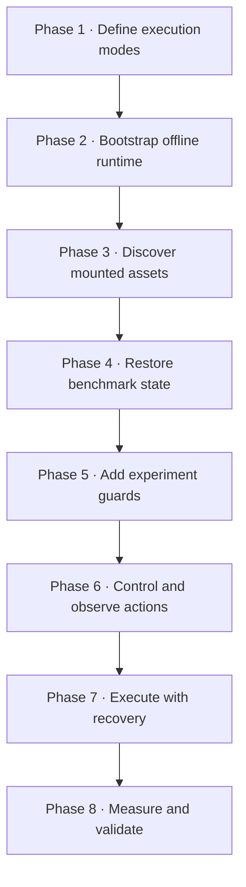
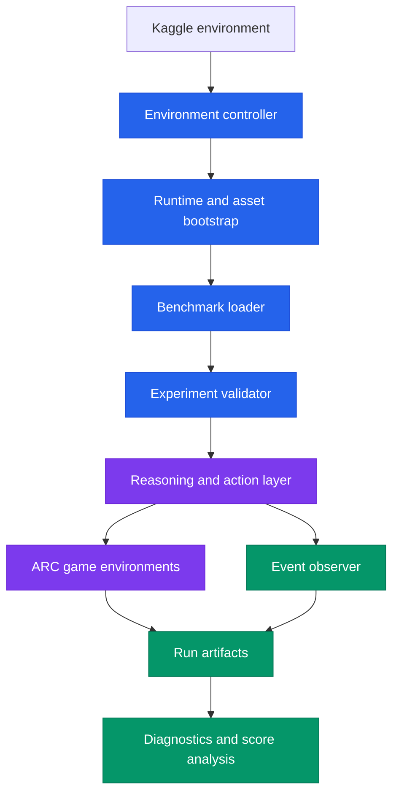
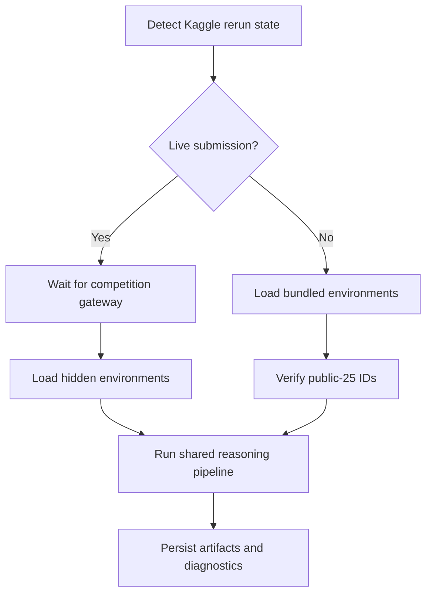
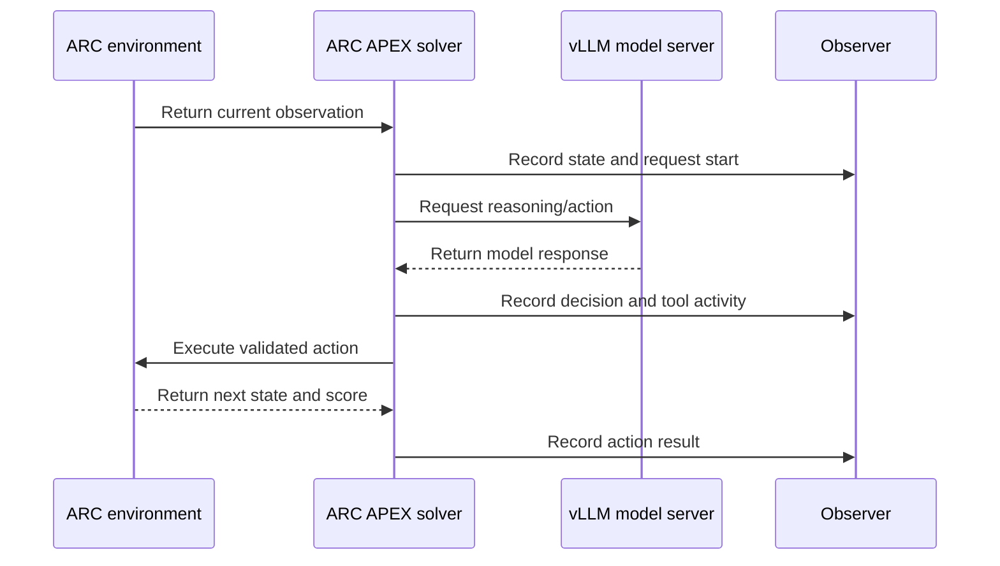
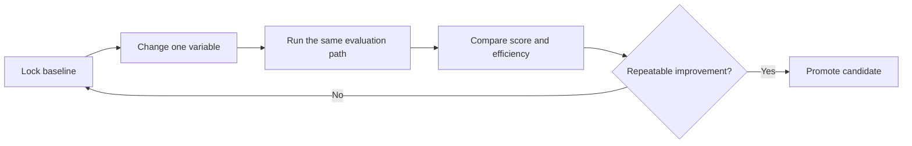

<div align="center">

# 🧩 ARC APEX

### Adaptive Reasoning & Problem-Solving Framework for ARC-AGI

An independently developed ARC-AGI research system built from the ground up—from
environment detection and GPU inference setup to action control, benchmark
execution, observability, and reproducible evaluation.

[](https://arcprize.org/)
[](https://www.kaggle.com/competitions/arc-prize-2026-arc-agi-3)
[](https://www.python.org/)
[](#requirements)
[](#research-status)

[Overview](#overview) • [Development process](#development-process) • [Architecture](#system-architecture) • [Explore code](#code-explorer) • [Run](#run-on-kaggle) • [Validate](#validation)

</div>

---

## Overview

ARC APEX is our end-to-end experimental framework for interactive abstract
reasoning. We developed the complete workflow step by step: configure the Kaggle
environment, start the inference runtime, discover mounted assets, restore the
benchmark, validate the active experiment, control agent actions, observe every
critical event, execute the games, and generate diagnostics.

The system is maintained in two synchronized forms:

- a Kaggle notebook for competition execution; and
- a modular repository with one documented Python file for every pipeline stage.

Each stage contains its own purpose, inputs, outputs, execution notes, and Mermaid
workflow diagram. This makes the reasoning infrastructure reviewable without
forcing contributors to inspect one large notebook.

> [!NOTE]
> ARC APEX is the project. Names retained inside a few low-level adapters are
> compatibility identifiers required by mounted runtime components; they do not
> represent the ownership or identity of this repository.

### Core objectives

| Objective | How ARC APEX addresses it |
| --- | --- |
| Adaptive reasoning | Runs an iterative observe → reason → act loop against interactive ARC environments. |
| Controlled experimentation | Uses explicit experiment arms and fails fast when the live server configuration differs. |
| Efficient inference | Tunes vLLM batching, cache allocation, CUDA behavior, and optional speculative decoding. |
| Reliable execution | Adds game-set checks, deadlines, watchdog recovery, teardown, and artifact preservation. |
| Full observability | Records requests, tool calls, decisions, actions, tokens, timing, and terminal states. |
| Reproducibility | Preserves cell-to-module hashes, validates executable equivalence, and runs CI checks. |

---

## Development process

ARC APEX was not assembled as one unstructured script. We built it in clear,
testable phases, with every phase solving a specific failure point found during
competition runs.



<details open>
<summary><strong>Phase 1 — Environment and submission awareness</strong></summary>

We first separated ordinary Kaggle sessions from real competition reruns. This
controls the game source, gateway behavior, diagnostics, deadline handling, and
submission output without relying on manual changes at run time.

**Result:** one pipeline supports both offline investigation and live competition
execution without mixing their scores.

</details>

<details>
<summary><strong>Phase 2 — Offline runtime and GPU serving</strong></summary>

We added offline installation from the competition wheelhouse, CUDA linker setup,
vLLM configuration, model-serving probes, and two controlled inference arms.

**Result:** the runtime can start with Internet disabled and exposes its exact
inference configuration before expensive benchmark execution begins.

</details>

<details>
<summary><strong>Phase 3 — Asset discovery and source integration</strong></summary>

Kaggle input paths can change when datasets are reattached or versioned. We built
marker-based discovery, mount resolution, import-path configuration, and explicit
setup command execution instead of depending on a single hard-coded directory.

**Result:** missing or ambiguous assets fail with a useful error instead of causing
a delayed crash during inference.

</details>

<details>
<summary><strong>Phase 4 — Benchmark restoration and routing</strong></summary>

We restore the serialized deployment target and benchmark, redirect all output to
Kaggle's writable directory, and select either live gateway environments or the
verified public-25 offline set.

**Result:** public diagnostics and hidden competition evaluation follow separate,
explicit code paths.

</details>

<details>
<summary><strong>Phase 5 — Experiment guards and action control</strong></summary>

We introduced configuration checks that inspect the running vLLM process and
analyzer constants before play begins. The action layer is installed only after
source fingerprints and expected settings match.

**Result:** an invalid experiment stops before consuming hours of GPU time.

</details>

<details>
<summary><strong>Phase 6 — Observability</strong></summary>

We instrument model requests, tool execution, solver decisions, engine actions,
tokens, timing, and shutdown. The observer writes asynchronously so diagnostics do
not block the reasoning loop.

**Result:** a score can be traced back to concrete run behavior instead of being
treated as an unexplained leaderboard number.

</details>

<details>
<summary><strong>Phase 7 — Benchmark execution and recovery</strong></summary>

We added game-coverage gates, a soft deadline with teardown reserve, background
server health monitoring, bounded restart attempts, terminal-state validation,
and guaranteed cleanup.

**Result:** the pipeline can recover from limited serving failures and still leave
behind auditable artifacts.

</details>

<details>
<summary><strong>Phase 8 — Diagnostics and repository validation</strong></summary>

We correlate observer events, aggregate efficiency metrics, preserve the canonical
notebook, map every code cell to a Python stage, and validate hashes and executable
equivalence in CI.

**Result:** the modular repository remains synchronized with the competition
notebook while supporting normal GitHub code review.

</details>

---

## System architecture



### Runtime decision path



### Observe–reason–act loop



---

## Repository structure

```text
arc-apex-4-18-github/
├── .github/workflows/validate.yml    # Automated integrity validation
├── docs/WORKFLOWS.md                 # All stage diagrams in one place
├── notebooks/arc-apex-4-18.ipynb    # Canonical Kaggle notebook
├── pipeline/                         # 11 documented pipeline stages
├── manifest.json                     # Cell mapping and SHA-256 records
├── run_all.py                        # Shared-namespace asynchronous runner
├── validate_repo.py                  # Notebook/repository equivalence checks
├── requirements.txt                  # Runtime dependency declaration
└── NOTICE.md                         # Ownership and dependency notice
```

---

## Code explorer

Every stage is independently documented but must be executed in the order below.
Click a filename to inspect its explanation, workflow, and implementation.

| Order | Stage | Responsibility |
| :---: | --- | --- |
| 01 | [`01_environment_and_submission_mode.py`](pipeline/01_environment_and_submission_mode.py) | Detect execution mode, select the experiment arm, configure vLLM/CUDA, and initialize paths. |
| 02 | [`02_install_arc_runtime.py`](pipeline/02_install_arc_runtime.py) | Install the ARC runtime from Kaggle's offline wheelhouse. |
| 03 | [`03_locate_source_bundle.py`](pipeline/03_locate_source_bundle.py) | Discover required source, model, and utility mounts. |
| 04 | [`04_import_source_and_run_setup.py`](pipeline/04_import_source_and_run_setup.py) | Configure imports and execute the declared setup sequence. |
| 05 | [`05_load_benchmark.py`](pipeline/05_load_benchmark.py) | Restore the target and benchmark and configure writable output. |
| 06a | [`06a_validate_experiment_arm.py`](pipeline/06a_validate_experiment_arm.py) | Confirm that the live inference server matches the requested arm. |
| 06b | [`06b_install_action7_patch.py`](pipeline/06b_install_action7_patch.py) | Validate and install the guarded action behavior. |
| 06c | [`06c_install_phase_a_observer.py`](pipeline/06c_install_phase_a_observer.py) | Capture requests, tools, decisions, actions, timing, and tokens. |
| 07a | [`07a_run_benchmark.py`](pipeline/07a_run_benchmark.py) | Select games, run the benchmark, monitor serving, score offline runs, and tear down. |
| 07b | [`07b_summarize_phase_a_diagnostics.py`](pipeline/07b_summarize_phase_a_diagnostics.py) | Correlate events and generate machine-readable metrics. |
| 08 | [`08_show_diagnostics.py`](pipeline/08_show_diagnostics.py) | Preserve lightweight diagnostics without costly HTML rendering. |

See [`docs/WORKFLOWS.md`](docs/WORKFLOWS.md) for the complete per-stage workflow
collection.

---

## Requirements

ARC APEX is designed for the Kaggle competition runtime.

- Kaggle ARC Prize competition data mounted under `/kaggle/input`;
- the model, runtime, and utility assets expected by the pipeline;
- an **RTX PRO 6000** Kaggle GPU session;
- Internet disabled, matching the competition environment;
- Python 3 and the competition's offline wheelhouse; and
- sufficient runtime to retain a final teardown reserve.

Local validation does not require a GPU because it verifies structure, hashes,
syntax, and notebook equivalence without running the solver.

---

## Run on Kaggle

### 1. Attach the required assets

Add the competition data, ARC APEX repository, model bundle, and runtime assets to
the notebook session.

### 2. Configure the accelerator

Select **RTX PRO 6000** and keep Internet disabled.

### 3. Choose one experiment arm

Edit only `ARM` in
[`pipeline/01_environment_and_submission_mode.py`](pipeline/01_environment_and_submission_mode.py):

```python
ARM = "A"
```

| Arm | MTP tokens | Purpose |
| :---: | :---: | --- |
| `A` | `3` | Control configuration |
| `B` | `0` | MTP-disabled comparison |

Change one experimental variable per run. If solver logic and serving parameters
change together, the score difference cannot be attributed correctly.

### 4. Run preflight validation

```bash
python run_all.py --list
python run_all.py --check
python validate_repo.py
```

### 5. Start the pipeline

```bash
python run_all.py
```

> [!WARNING]
> Do not run files under `pipeline/` separately. They intentionally share one
> namespace, and the benchmark stage uses notebook-style top-level `await`.

---

## Outputs

Run artifacts are written to `/kaggle/working`.

| Artifact | Purpose |
| --- | --- |
| Benchmark run data | Stores game histories, actions, scores, and terminal states. |
| Observer event stream | Records model, tool, solver, and environment events. |
| Diagnostic summaries | Aggregates latency, tokens, actions, failures, and completion. |
| `score.json` | Stores the offline public-25 evaluator result. |
| `submission.parquet` | Provides the valid offline Save & Run placeholder. |
| Watchdog and teardown logs | Captures serving health, recovery, and cleanup. |

> [!IMPORTANT]
> The offline `score.json` and Kaggle leaderboard score come from different
> evaluation paths. They should never be presented as the same measurement.

---

## Validation

[`validate_repo.py`](validate_repo.py) checks that:

1. the canonical notebook SHA-256 matches `manifest.json`;
2. every mapped notebook cell retains its recorded SHA-256;
3. every documented Python stage preserves the corresponding executable code;
4. all 11 stages compile with top-level-await support; and
5. the complete pipeline order remains intact.

```bash
python run_all.py --check
python validate_repo.py
```

Expected result:

```text
Validated 11 pipeline stages.
Repository validation passed: 11 documented stages.
```

The same validation runs through
[`.github/workflows/validate.yml`](.github/workflows/validate.yml).

<details>
<summary><strong>Integrity record</strong></summary>

- Canonical notebook: `notebooks/arc-apex-4-18.ipynb`
- Notebook SHA-256:
  `36e6f87c15387994cea4b67de37e25d76d460f8c85da3e587126b0efdc700d93`
- Documented executable stages: `11`
- Cell-to-stage mapping: [`manifest.json`](manifest.json)

</details>

---

## Research status

ARC APEX is active research, not a claim that ARC-AGI is solved.

- ✅ End-to-end environment, inference, benchmark, and diagnostic workflow
- ✅ Separate offline and live-submission execution paths
- ✅ Guarded A/B inference experiments
- ✅ Action-level and request-level observability
- ✅ Watchdog recovery and teardown protection
- ✅ Notebook-to-repository integrity validation
- ⚠️ GPU performance must be measured through fresh Kaggle runs
- ⚠️ Hidden leaderboard performance cannot be guaranteed from offline results

### Experiment cycle



For every run, record the revision, arm, execution mode, game coverage, completed
levels, action count, exceptions, request latency, queue time, and final score.

---

## Limitations

- The full solver depends on Kaggle-specific mounts, APIs, GPU infrastructure,
  and environment variables.
- Pipeline stages share state intentionally and are not standalone applications.
- Offline public environments and hidden competition environments are different
  evaluation populations.
- Inference can remain stochastic even when configuration is unchanged.
- Competition data, model weights, and external runtime packages are not included
  in this repository.

<details>
<summary><strong>Troubleshooting</strong></summary>

| Problem | What to verify |
| --- | --- |
| Setup file or model not found | Confirm every required Kaggle input is attached. |
| Experiment guard fails | Match the running vLLM flags to the selected arm; do not bypass the guard. |
| Public game-set mismatch | Attach the exact competition environment bundle. |
| Top-level `await` error | Use `python run_all.py`; do not execute stage `07a` directly. |
| No actions recorded | Check server readiness, observer events, and watchdog logs. |
| Offline and leaderboard scores differ | This is expected because the evaluation paths are different. |

</details>

---

## Project ownership and dependencies

ARC APEX is our independently developed project. Its pipeline architecture,
experiment controls, action safeguards, observability system, validation workflow,
and documentation belong to this project.

The system integrates Kaggle competition interfaces and external runtime/model
packages. Those dependencies retain their respective licenses and ownership. See
[`NOTICE.md`](NOTICE.md) for the dependency notice.

---

<div align="center">

[Back to top](#-arc-apex)

</div>
