# Pipeline workflow diagrams

These diagrams mirror the Mermaid definitions embedded in each Python stage.

## `01_environment_and_submission_mode.py` — Environment and submission mode

Detect the Kaggle execution mode, select experiment arm A or B, configure vLLM tuning, set framework flags, and prepare CUDA and working-directory paths.

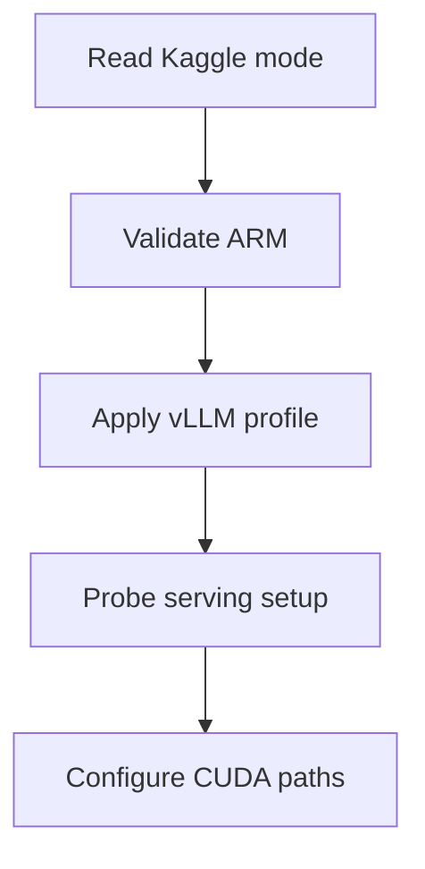

## `02_install_arc_runtime.py` — Install the ARC runtime

Install arc-agi from Kaggle's offline competition wheelhouse without contacting the internet.

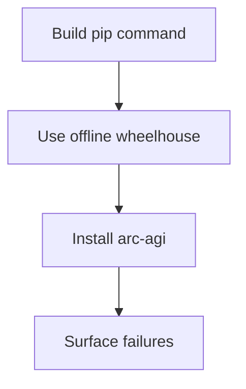

## `03_locate_source_bundle.py` — Locate the source bundle

Find the TAAF source bundle by marker file and resolve every Kaggle dataset or utility-script mount used by setup.

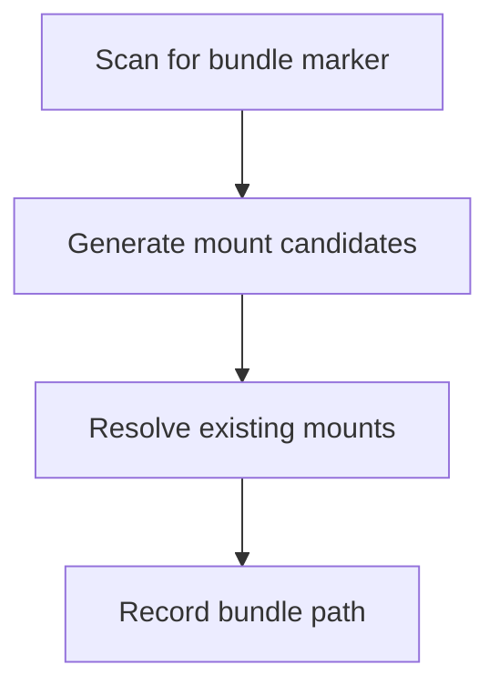

## `04_import_source_and_run_setup.py` — Import source and run setup

Expose bundled repositories on Python's import path, build the setup environment, and execute the source bundle's declared setup commands.

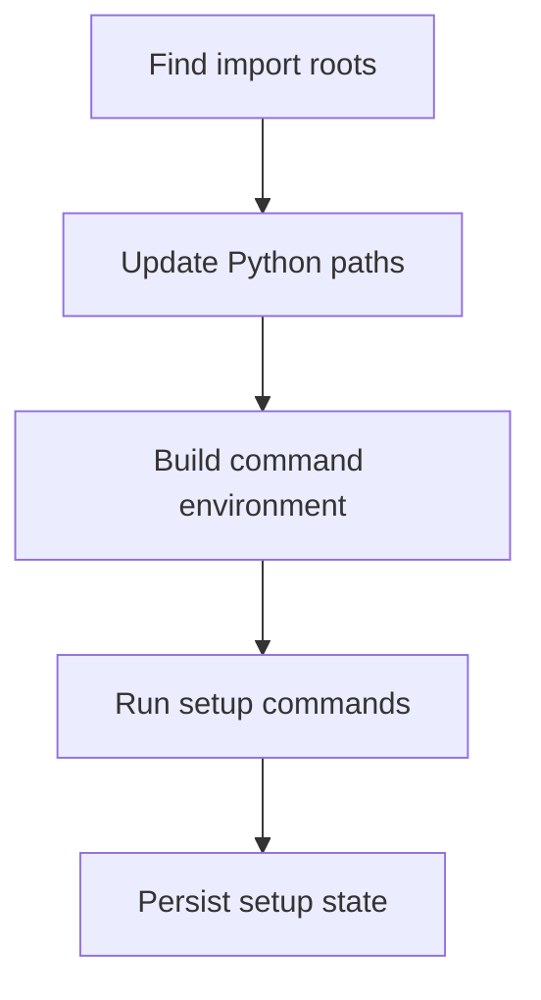

## `05_load_benchmark.py` — Load the benchmark

Restore the serialized deployment target and benchmark, stamp the true submission state, and redirect output to Kaggle's writable directory.

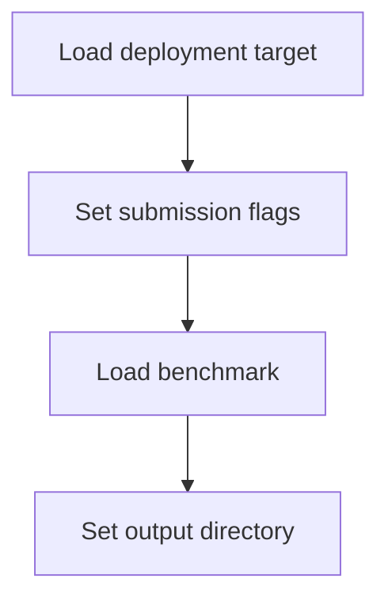

## `06a_validate_experiment_arm.py` — Validate the experiment arm

Inspect the live vLLM command line and frozen analyzer settings, then fail fast if the running server does not match the requested A/B experiment arm.

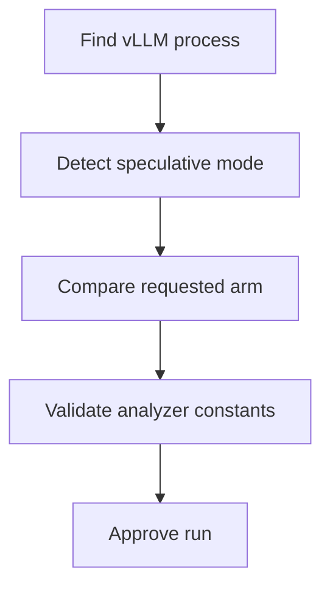

## `06b_install_action7_patch.py` — Install the ACTION7 patch

Verify analyzer configuration and safely install the ACTION7 behavior patch with source fingerprints and repeat-install protection.

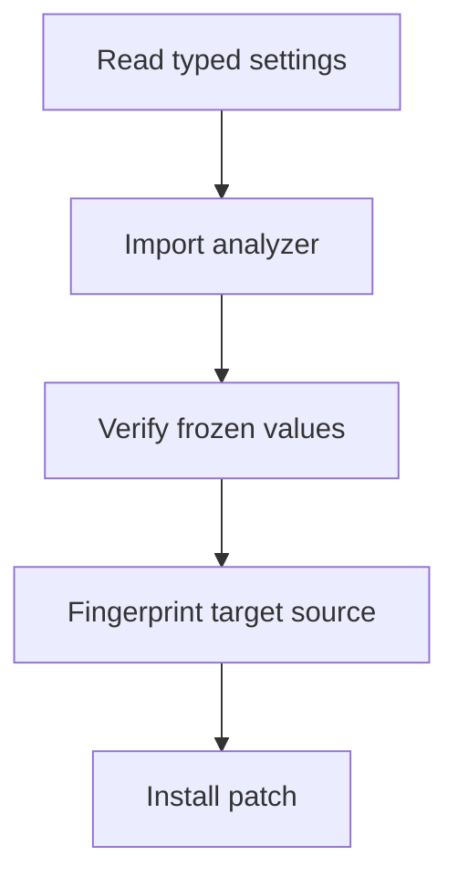

## `06c_install_phase_a_observer.py` — Install the Phase A observer

Attach non-invasive instrumentation to model requests, tool calls, solver decisions, and engine actions so the run can be audited afterward.

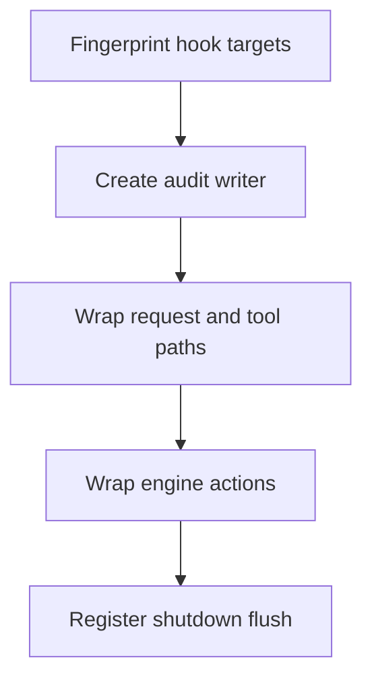

## `07a_run_benchmark.py` — Run the benchmark

Select live hidden games or the fixed public-25 offline set, enforce run gates, start the model-server watchdog, execute the benchmark, score public runs, and always tear down.

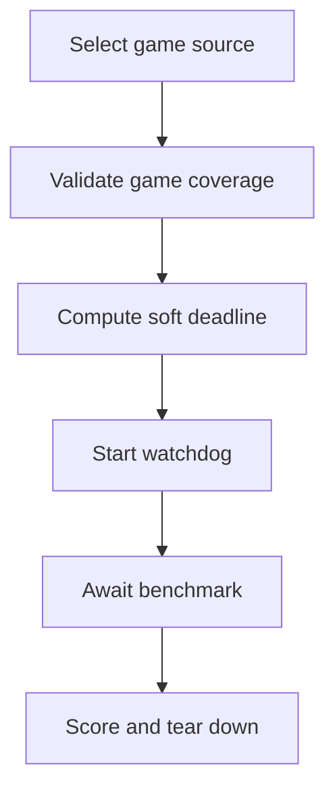

## `07b_summarize_phase_a_diagnostics.py` — Summarize Phase A diagnostics

Read the observer event stream, correlate starts and ends, compute request/action/token metrics, and write machine-readable audit summaries.

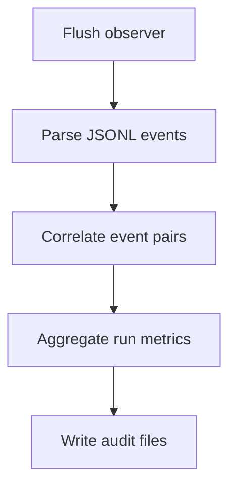

## `08_show_diagnostics.py` — Show diagnostics

Document that HTML rendering is intentionally skipped because minimal diagnostics are enabled.

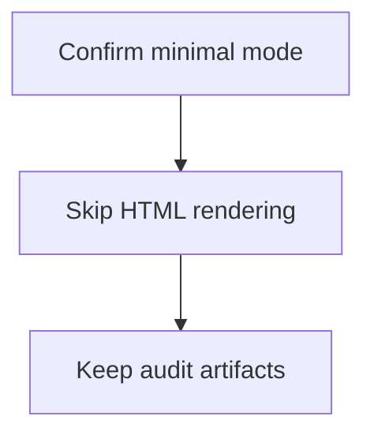
